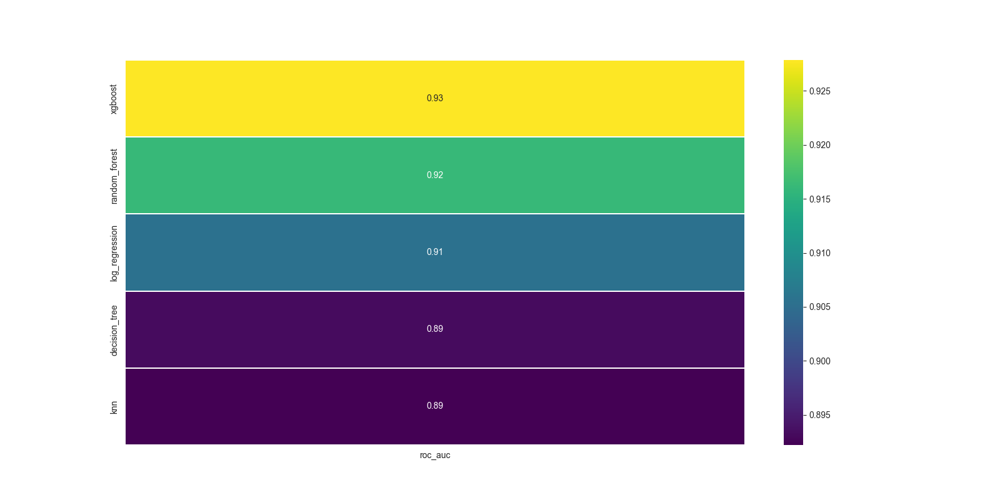
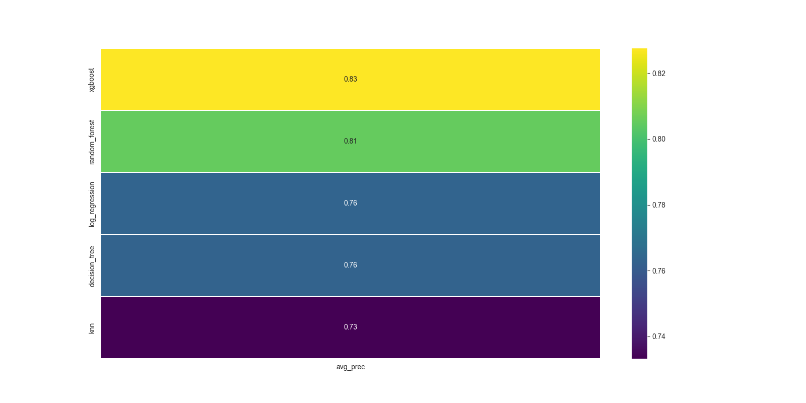

# Сравнение моделей классического ML в задаче классификации

##  Описание проекта:
Требуется предсказать, превышает ли годовой доход физического лица 50 тысяч долларов в год, основываясь на данных переписи.  
Датасет известен под названием **'Census Income dataset'**. Набор данных содержит 15 атрибутов, включая возраст, пол, уровень образования и другие важные сведения о человеке.

## 📂 Содержимое
- `Pet_project_dataset_adult.ipynb` — Jupyter Notebook проекта
- `Data` — исходные данные  
- `requirements.txt` — зависимости проекта
- `Images` - примеры визуализаций

## Цель проекта :dart::
Сравнить модели классического ML по пороговым и непороговым метрикам. Добиться максимальной **precision** при **recall >= 0.6**. Выбрать оптимальную модель.

## Заключение по итогам проекта:
1. Был проведен **EDA** над полученными данными.
2. Было проведено сравнение моделей машинного обучения по пороговым и непороговым метрикам.
3. Была найдена оптимальная модель - **XGBoost**, которая показала **precision = 0.82** при **recall >= 0.6**.

## Примеры визуализаций проекта:

   
  <b>Сравнение моделей по ROC AUC</b>

  <!-- небольшой отступ между картинками -->

   
  <b>Сравнение моделей по Average Precision</b>

## Использованные инструменты и языки:
* Python
* Numpy
* Pandas
* Phik
* Matplotlib
* Seaborn
* Scikit-learn
* XGBoost

## Направления деятельности:
* Машинное обучение
* Exploratory Data Analysis
* Анализ и предобработка данных